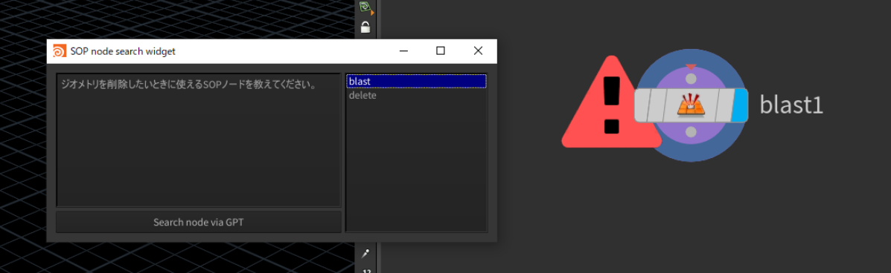

## OpenAI chat with assistant sample


### memo
公式ドキュメントで別途学習済みのGPT(=Assistants API)に対し、 "ノードの用途" から検索を掛けるもの

- GPTからは候補となるノード名が返ってくるため、そのままリスト表示
- リストを選択するとノードがネットワークエディタに配置される


### image


### article
https://qiita.com/shin_t_o_/items/a19444518f1a14186369


### directory structure

```
├── README.md
├── pyproject.toml  # 試験採用したrye用の設定ファイル
├── requirements-dev.lock  # 同上
├── requirements.lock  # 同上
└── src
    ├── concat_txt.py  # 対象ディレクトリ内のtxtドキュメントファイルを結合
    ├── extract_json.py  # 対象ディレクトリ内のtxtドキュメントファイルをJSON形式にパース
    └── script.py  # shelf toolsのスクリプト
```